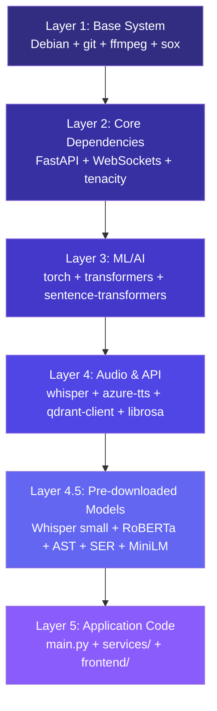
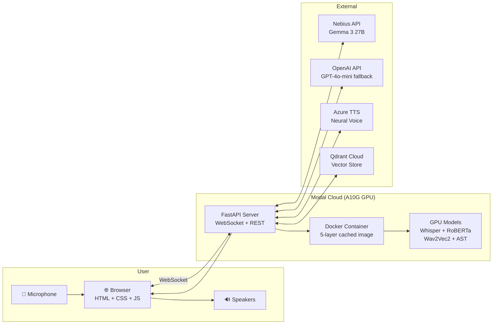
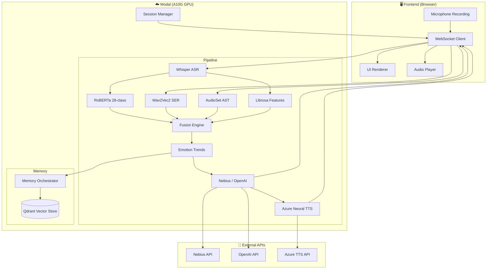
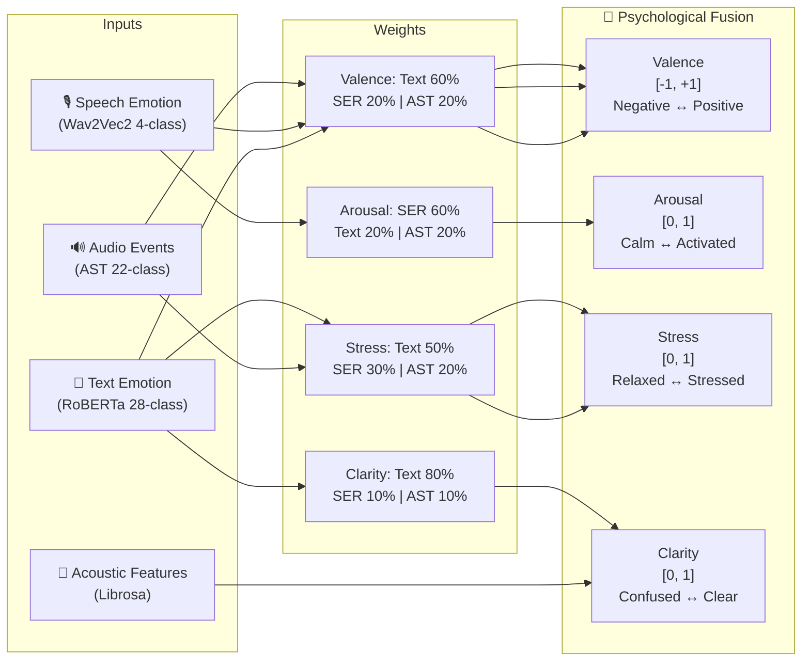
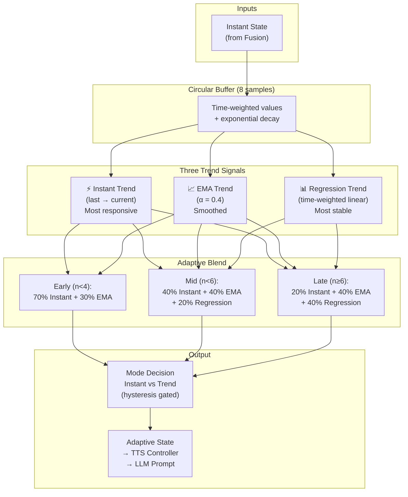
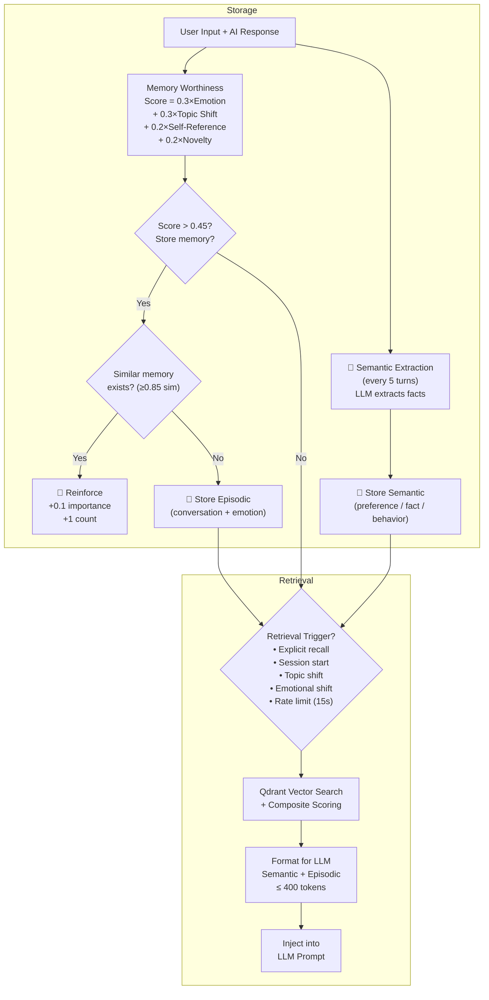
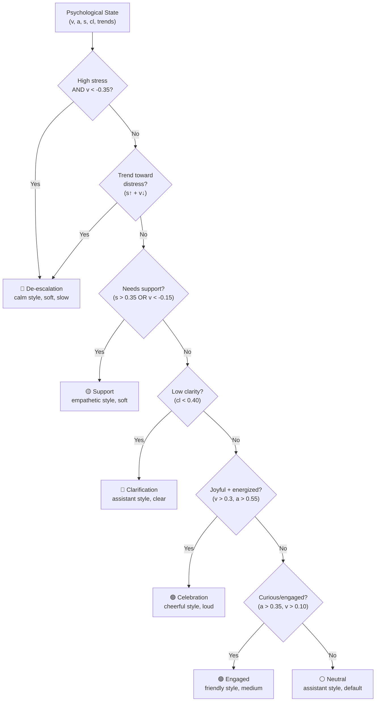
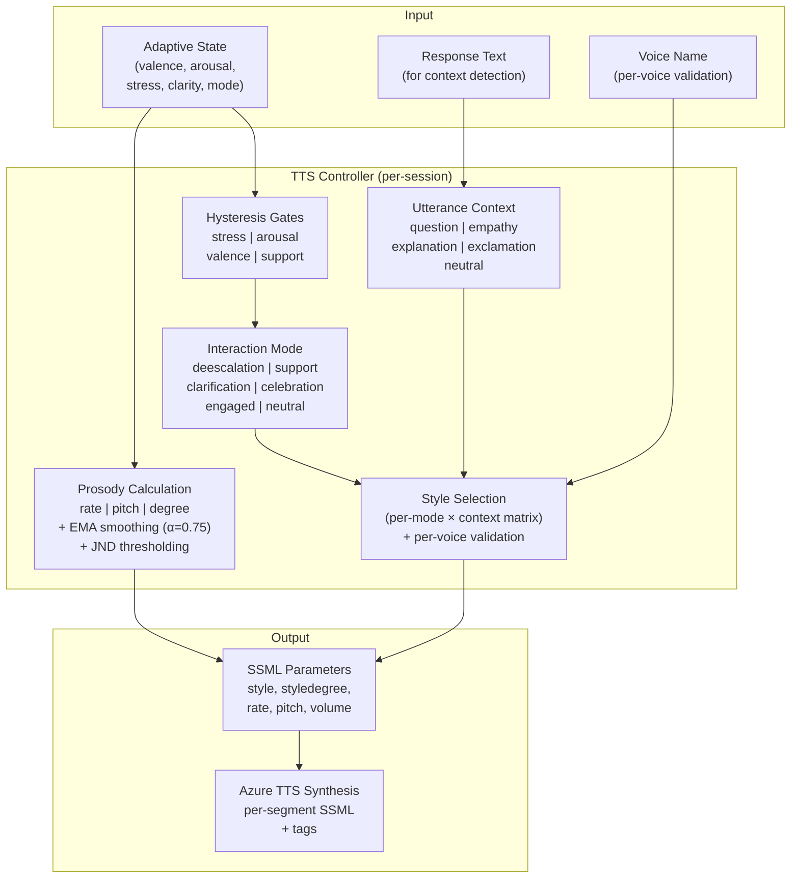

# Psychologically Adaptive AI Voice Assistant

A real-time conversational AI that listens to your voice, detects your emotional state across multiple modalities, and responds with psychologically adaptive language and voice — adjusting tone, pace, and style based on how your emotions are trending over the conversation.

> For full technical details, see [documentation.md](documentation.md).

---

## What It Does

- **Transcribes** speech with OpenAI Whisper (local, English)
- **Detects emotions** from text (28 classes via RoBERTa), voice (4 classes via Wav2Vec2), and audio events (22 categories via AST)
- **Fuses** all signals into a 4-dimensional psychological state: Valence, Arousal, Stress, Clarity
- **Tracks emotional trajectories** — adapts based on *where* emotions are heading, not just current values
- **Stores long-term memories** in Qdrant (episodic + semantic) for contextually aware responses
- **Generates responses** via LLM (Nebius Gemma 3 27B / OpenAI GPT-4o-mini fallback) informed by emotional state and memory
- **Speaks back** using Azure Neural TTS with dynamically chosen voice style, prosody, and volume
- **Streams responses** — text appears immediately while audio synthesizes in the background
- **Saves sessions** with a ChatGPT-like sidebar (create, switch, delete, search, export)

---

## Features

### Emotion-Adaptive Voice
The TTS controller adjusts six parameters in real-time:

- **Style** — empathetic, cheerful, serious, friendly, etc. (validated per-voice)
- **Style degree** — how strongly the style is applied
- **Rate** — slower for stress, faster for engagement
- **Pitch** — lower for empathy, higher for excitement
- **Volume** — softer for de-escalation, louder for celebration
- **Hysteresis gates** — prevent rapid style flip-flopping

### Long-Term Memory
- **Episodic memories** — conversation episodes with emotional context
- **Semantic memories** — extracted user facts, preferences, and behaviors
- **Reinforcement** — repeated similar experiences strengthen existing memories
- **Event-driven retrieval** — topic shifts, emotional shifts, explicit recall triggers
- **Graceful degradation** — conversations work without Qdrant; memory is optional

### Streaming LLM → TTS
The WebSocket protocol sends four progressive messages per turn:
1. `thinking` — processing started
2. `transcript` — user's speech transcribed
3. `response_text` — AI response text (displayed immediately)
4. `audio_ready` — TTS audio (played as soon as ready)

---

## Prerequisites

- Python 3.11+
- [Modal](https://modal.com) account with CLI installed
- OpenAI API key (for LLM fallback)
- Nebius API key (for primary LLM)
- Azure Cognitive Services Speech key + region (for TTS)
- Qdrant Cloud cluster or self-hosted Qdrant (for long-term memory)

---

## Setup

### 1. Clone and install Modal

```bash
git clone <repo-url>
cd "Emotion psychologist"
pip install modal
modal setup        # authenticates your Modal account
```

### 2. Create Modal secrets

```bash
# API keys for LLM providers
modal secret create emotion-env \
  OPENAI_API_KEY="sk-..." \
  NEBIUS_API_KEY="..." \
  AZURE_TTS_KEY="..." \
  AZURE_TTS_REGION="centralindia" \
  WHISPER_MODEL="small"

# Qdrant connection (Cloud — no QDRANT_PORT needed for HTTPS)
modal secret create qdrant-credentials \
  QDRANT_URL="https://your-cluster-id.region.cloud.qdrant.io" \
  QDRANT_API_KEY="..."

# Self-hosted Qdrant — include port
modal secret create qdrant-credentials \
  QDRANT_URL="http://your-host" \
  QDRANT_PORT="6333" \
  QDRANT_API_KEY="optional"
```

### 3. Deploy

```bash
modal deploy backend/main.py
```

First deployment builds all Docker layers, pre-downloads ~2.2 GB of models, and sets up the environment. This takes ~3–5 minutes. Subsequent code-only redeployments take ~10 seconds because models are baked into Docker image layers.



> 💡 Code changes only rebuild Layer 5 (~10s). Dependency changes rebuild from Layer 3+ (~3-5 min).

---

## Using the App

After deployment, Modal prints your app URL:
```
https://<your-username>--conversational-ai-realtime-fastapi-app.modal.run
```

1. Open that URL in a browser
2. Select a voice from the pill selector
3. Click **Start** and speak — the system records until you click **Stop**
4. Watch the transcript appear, then the AI response streams in word-by-word
5. Audio plays automatically once synthesized
6. Emotional state updates in real-time with circular progress indicators

### Keyboard Shortcuts

| Key | Action |
|-----|--------|
| **Space** | Start / Stop recording |
| **Escape** | Cancel recording |

### Session Management

- Click **New Chat** (pen icon) in the sidebar to start a fresh session
- Previous sessions appear in the sidebar — click to switch
- Use the **search bar** to filter conversations by title
- Click the **✕** on any session to delete it
- Click **Export** to download all session data as JSON

### Debug Panels

Click **Debug** in the sidebar footer to show/hide the debug panels. Click the panel headers to expand/collapse:

- **Model Outputs** — ASR transcript, text emotion scores, speech emotion, audio events, acoustic features, fusion output
- **Memory & State** — session info, topic tracking, emotional trends with sparkline, dialogue state, long-term memory stats

---

## Local Development (optional)

To run with live reloading instead of a fixed deployment:

```bash
modal serve backend/main.py
```

Modal provides a temporary URL that hot-reloads on file changes.

---

## Project Structure

```
.
├── frontend/
│   ├── index.html              # HTML structure
│   ├── styles.css              # All CSS (design tokens, glassmorphism, responsive)
│   └── app.js                  # All JavaScript (WebSocket, sessions, UI updates)
├── backend/
│   ├── main.py                 # Modal app — WebSocket, API, session management
│   ├── conversation_state.py   # Dialogue state, intent detection, coherence
│   ├── emotional_trends.py     # Trend tracking, EMA, mode switching
│   ├── memory_manager.py       # Topic detection, retrieval policy
│   ├── memory_store.py         # Qdrant vector store with graceful degradation
│   ├── memory_orchestrator.py  # Memory worthiness, storage, extraction
│   └── services/
│       ├── services.py         # Whisper ASR, Text Emotion, SER, AST
│       ├── fusion.py           # Psychological state fusion engine
│       ├── llm_client.py       # Nebius primary + OpenAI fallback
│       └── tts_azure.py        # Azure Neural TTS, prosody controller
├── documentation.md            # Full technical reference
└── README.md
```

---

## Architecture

### Deployment Architecture



### System Overview



### Fusion Engine

Multimodal signals are fused into four psychological dimensions:



| Dimension | Text | SER | AST | Meaning |
|-----------|------|-----|-----|---------|
| **Valence** | 60% | 20% | 20% | Negative ↔ Positive |
| **Arousal** | 20% | 60% | 20% | Calm ↔ Activated |
| **Stress** | 50% | 30% | 20% | Relaxed ↔ Stressed |
| **Clarity** | 80% | 10% | 10% | Confused ↔ Clear |

### Emotional Trend Tracking



- **Hysteresis gates** prevent rapid mode switching (1.5s minimum dwell time)
- **JND thresholds** — rate changes <2%, pitch <1%, degree <0.05 are ignored (inaudible)
- **EMA smoothing** (α=0.75) on all prosody parameters prevents jarring voice changes

### Memory System



**Composite relevance score:**
```
score = 0.50 × semantic_similarity
      + 0.20 × importance_score
      + 0.20 × reinforcement_ratio
      + 0.10 × recency_decay (0.95^age_days)
```

### Interaction Mode Classification



Each mode maps to a specific Azure TTS style, prosody profile, and volume level. The TTS controller further adjusts parameters based on utterance context (question vs empathy vs explanation).

### TTS Voice Adaptation



---

## Tech Stack

| Layer | Technology |
|-------|------------|
| Hosting | Modal (serverless GPU — A10G) |
| ASR | Local Whisper (`openai-whisper`) |
| Text Emotion | RoBERTa GoEmotions — 28 classes (HuggingFace) |
| Speech Emotion | Wav2Vec2 SUPERB — 4 classes (HuggingFace) |
| Audio Events | AudioSet AST — 22 categories (HuggingFace) |
| LLM | Nebius Gemma 3 27B (OpenAI GPT-4o-mini fallback) |
| TTS | Azure Neural TTS with adaptive prosody |
| Long-term Memory | Qdrant + sentence-transformers (MiniLM-L6-v2) |
| Web Framework | FastAPI + WebSockets |
| Audio Processing | ffmpeg, Librosa |
| Frontend | Vanilla JS, CSS Custom Properties, Glassmorphism UI |

---

## License

Licensed under the Apache License, Version 2.0. See [LICENSE](LICENSE) for the full license text.
